##### [License](#license) | [TTF](#ttf) | [BDF](#bdf) | [Mac](#mac) | [Console](#console) | [Grub](#grub) | [Changes](#changes)| [New](#new) | [Images](#images)
#### <a name="license"></a>1. The Terminusa font
This is a modified freeware Terminus v4.20 font under new name Terminusa (aka
altered). Only 9pt and 12pt sizes for 96DPI to use bitmaps in generated TrueType files.

These fonts are licencsed under GPL v2.0 or later, with font embedding exception.

As a special exception, if you create a document which uses this font, and embed this font or unaltered portions of this font into the document, this font does not by itself cause the resulting document to be covered by the GNU General Public License.

This exception does not however invalidate any other reasons why the document might be covered by the GNU General Public License. If
you modify this font, you may extend this exception to your version of the font, but you are not obligated to do so. If you do not wish to do so, delete this exception statement from your version.
#### <a name="ttf"></a>2. Normal, Bold and Small TrueType bitmap-only files
These fonts work in Ms Windows with console and terminal apps and also in many Linux distros.
Do not install Terminusa-Bold.ttf font if you want to use system autogenerated bold style.

[Terminusa.ttf](Terminusa.ttf)
[Terminusa-Bold.ttf](Terminusa-Bold.ttf)
[TerminusaSmall.ttf](TerminusaSmall.ttf)
[TerminusaSmall-Bold.ttf](TerminusaSmall-Bold.ttf)

You can install them in modern Linux distros too by copying to `~/.fonts` or some dir under `/usr/share/fonts/truetype` then creating `/etc/fonts/conf.d/90-terminusa.conf` or `~/.fonts.conf` or `~/.config/fontconfig/fonts.conf` with contents:

```
<?xml version="1.0"?>
<!DOCTYPE fontconfig SYSTEM "fonts.dtd">
<fontconfig>
 <selectfont>
  <acceptfont>
   <pattern>
    <patelt name="family">
     <string>Terminusa</string>
    </patelt>
   </pattern>
  </acceptfont>
 </selectfont>
 <selectfont>
  <acceptfont><pattern>
   <patelt name="family">
    <string>Terminusa Small</string>
   </patelt></pattern>
  </acceptfont>
 </selectfont>
</fontconfig>
```
After that execute command `fc-cache -f` to get them visible in apps.
To check presence of installed fonts use command:
 `fc-list Terminusa file family style pixelsize`

Usage with xterm: `xterm -fa Terminusa -fs 12 &`

Usage with xjed: `xjed -fn Terminusa -fs 12 &`

You can use them in modern **gnome-terminal** or **ptyxis** too.
### <a name="bdf"></a>3. Bitmap normal/bold/small source fonts
Fonts for X11 and script for installing them in `~/.fonts` folder

[ter-au12n.bdf](ter-au12n.bdf)
[ter-au12b.bdf](ter-au12b.bdf)
[ter-au16n.bdf](ter-au16n.bdf)
[ter-au16b.bdf](ter-au16b.bdf)
[ter-aus12n.bdf](ter-aus12n.bdf)
[ter-aus12b.bdf](ter-aus12b.bdf)
[bdfinst.sh](bdfinst.sh)

Modify fontconfig settings as in TTF case then run script which generates PCF format fonts in `~/.fonts` and rehashes fontconfig cache.

To check presence of installed fonts use command `fc-list Terminusa file family style pixelsize`
#### <a name="mac"></a>4. Mac OS font
In case of not working TTF's - install using **Font Book.app**
Download and open all desired font files at once or one by one and then remember to activate all of installed fonts to have them available for applications.

[Terminusa.dfont](Terminusa.dfont)
[Terminusa-Bold.dfont](Terminusa-Bold.dfont)
[TerminusaSmall.dfont](TerminusaSmall.dfont)
[TerminusaSmall-Bold.dfont](TerminusaSmall-Bold.dfont)
#### <a name="console"></a>5. Linux console font
[Lat2-Terminusa16.psf.gz](Lat2-Terminusa16.psf.gz)
[Lat2-TerminusaBold16.psf.gz](Lat2-TerminusaBold16.psf.gz)

##### Installation in Debian based distros
As admin user copy the chosen font to `/usr/share/kbd/consolefonts` folder then modify console setup config file `/etc/default/console-setup` with lines:

```
CHARMAP="UTF-8"
FONT="Lat2-Terminusa16.psf.gz"
```
You can use UTF-8 or iso-8859-2 encoding settings for console while UTF-8 is
the preffered one.
After that execute command `setupcon --save` and `update-initramfs -u` to have it as the console font in ramdisk.
Remember to remove cached font before installing a new wersion under the same name: `rm /etc/console-setup/cached_Lat2-Terminusa16.psf.gz`
#### <a name="grub"></a>6. Grub bootloader font
[terminusa16.pf2](terminusa16.pf2)
[terminusab16.pf2](terminusab16.pf2)
#### <a name="changes"></a>7. Modifications
 0 more different then O 
    
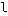 1 visually more different then l

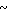 lower asciitilde

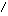

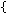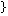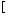![\]](img/x5d.png)
vertical positioning for programming usage
#### <a name="new"></a>8. New glyphs
 $2236 ratio

 $226A much less then

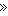 $226B much greater then

 $25A0 black square

 $25A1 white square

 $25B4 black up small triangle

 $25BA black right-pointing pointer

 $25BE black down small triangle

 $25C4 black left-pointing pointer

 $25C6 black lozenge

 $25C8 white diamond with small black diamond

 $25CA lozenge

 $25CB dotted circle

 $25CF black circle

 $2605 black star

 $2606 white star
#### <a name="images"></a>9. Images
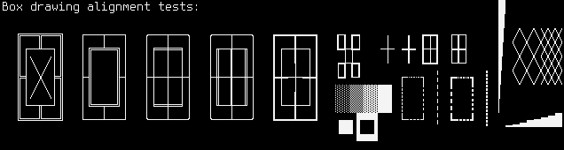  
Box drawing and special glyphs

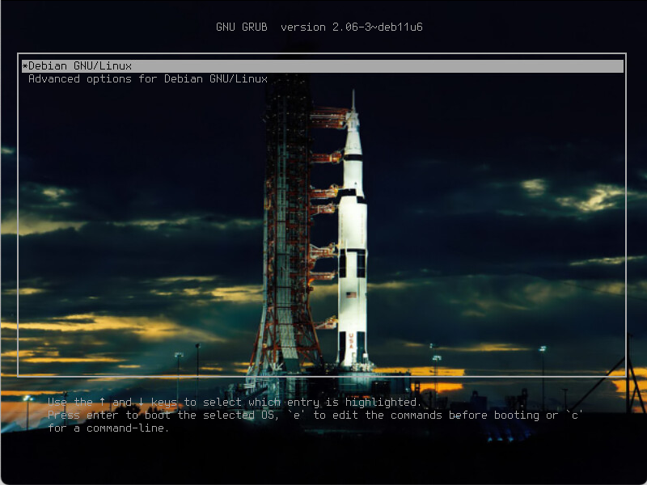  
Grub2 with 16px Terminusa font

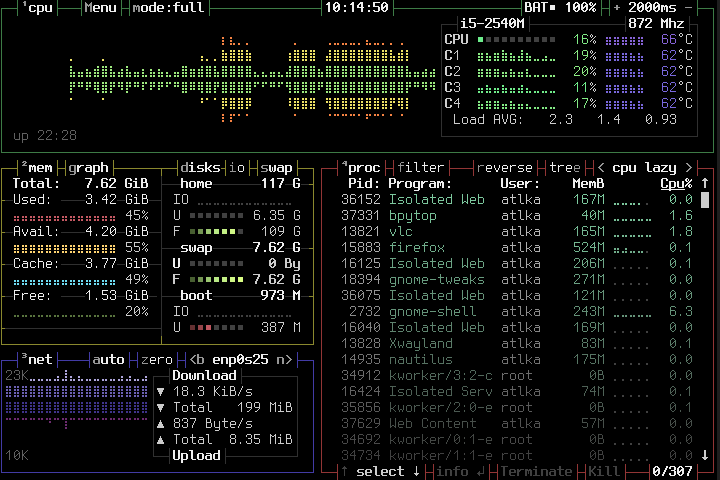  
BpyTop with 16px Terminusa font

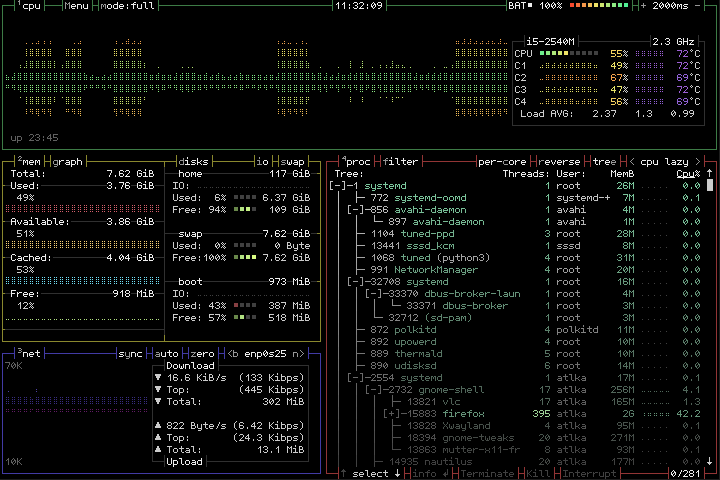  
BpyTop with 12px TerminusaSmall font
